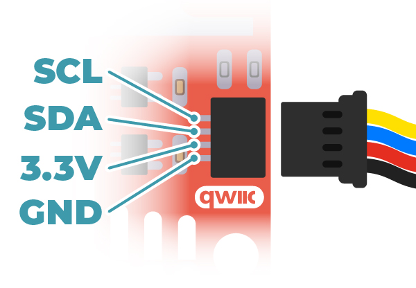

# gciSensors

## Why?

I love Adafruit sensors with QWIIC but their drivers are geared towards
hobbyists and favor low power consumption over performace. I try to
strip out unnecessary abstraction and enable high data rate.

This library is primarily just drivers for I2C sensors I use.

- Accelerometers/Gyroscopes:
    - LSM6DSOX
- Magnetometers:
    - LIS3MDL
- Pressure/Temperature
    - BMP380
    - DPS310
- GPS:
    - PA1010D

## Units

| Sensor Type | Units        | Abbreviation
|-------------|--------------|--------------|
| Accels      | gravity      | g
| Gyros       | degrees/sec  | dps
| Mags        | gauss        | gs
| Temperature | Celcius      | C
| Pressure    | Pascal       | Pa
| Altitude    | meter        | m
| Lat/Lon     | decimal degrees | deg
| Rate        | hertz        | Hz
| Time        | seconds      | sec

## LSM6DSOX

- Accelerometer ±2/±4/±8/±16 g at 1.6 Hz to 6.7KHz update rate
- Gyroscope: ±125/±250/±500/±1000/±2000 dps at 12.5 Hz to 6.7 KHz
- 32 bit timer at 25 usec resolution
- I2C Address `0x6A` or `0x6B`
- `init()`:
    - set accel to `RATE_104_HZ` `ACCEL_RANGE_4_G`
    - sets gyro to `RATE_104_HZ` `GYRO_RANGE_2000_DPS`

```c++
LSM6DSOX::gciLSM6DSOX imu;
imu.init(ACCEL_RANGE_4_G, GYRO_RANGE_2000_DPS, RATE_208_HZ); // setup sensor
bool ok = imu.ready(); // true when new data available
if (ok) lsm6dsox_t s = imu.read();
// s.ok => good read true/false
// s.ax => accel x,y,z in g's
// s.gx => gyro x,y,z in deg/sec
// s.temp => temperature in C
```

## LIS3MDL

> I am having issues with this sensor. I think it must be calibrated to produce
> any useable data. No matter what I do, I can not use it as a compass ... I
> am doing something wrong either here or in a filter that turns the measurements
> into heading!

- ±4/±8/±12/±16 gauss selectable magnetic full scales
- 16-bit data output
- Interrupt generator
- I2C Address `0x1C` or `0x1E`
- 400 kHz max
- `init()`:
    - set range to `RANGE_4GS`
    - set ODR to `ODR_155HZ`

```c++
LIS3MDL::gciLIS3MDL mag;
mag.init();
bool ok = mag.ready(); // true when new data available
list3mdl_t m = mag.read();
// m.x => mag x,y,z in gauss
// m.ok => good read true/false
```

## BMP390

- `init()`: sets up the sensor
    - Does a soft reset of sensor
    - Enables both pressure and temperature
        - pressure oversample 2x
        - temperature oversample 1x
    - Sets power mode to `MODE_NORMAL` or continous reading
    - ODR set to `ODR_100_HZ`
    - IIR filter set to `IIR_FILTER_COEFF_1`

```c++
BMP390::gciBMP390 bmp;
bmp.init();
bool ok = bmp.ready(); // true when new data available
bmp390_t pt = bmp.read();
// pt.ok => good read true/false
// pt.press => 24-bit, pressure in Pa
// pt.temp => 24-bit, temperature in C
```

## DPS310

- `init(DPS_XXX)` where `XXX` is `128_ALT`, `128`, `64` or `32`
- Pressure: 300-1200 hPa
    - Precision: ±0.002 hPa / ±2 cm
    - Accuracy:
        - Relative: ±0.06 hPa / ±50 cm
        - Absolute: ± 1 hPa / ±8 m
    - Sensitivity: ±0.5 Pa/K
- Temperature: -40-85 C
    - Accuracy: ±0.5 C
- Address: `0x77`

```cpp
gciDPS310 press;

bool ok = false;
while (ok == false) {
    ok = press.init(DPS_32HZ);
    sleep_ms(100);
}

printf("/// Press/Temp Started ///\n");

while (1) {
    dps310_t ans = press.read();
    if (ans.ok == false) {
        sleep_ms(5);
        continue;
    }

    float alt = altitude(ans.pressure);
    printf("Press: %8.1f Pa  Temp: %5.2f C  Alt: %10.1f m\n", ans.pressure, ans.temperature, alt);
    sleep_ms(32);
}
```

OK, there are a lot of ways you can mix and match how
you oversample (OS) and set your datarate, so I picked some
that seemed good to me. I prefer to go fast, but have
some level of OS

```
pg 30, Table 16

Rate_temp * MeasTime_temp + Rate_pres * MeasTime_pres < 1 second

|    | Press   | Temp    |     |     |
|    |----|----|----|----| Pa  |  cm |
| Hz | OS | Hz | OS | Hz | RMS | RMS |
|----|----|----|----|----|-----|-----|
|128A| 1  | 128| 1  | 128| 2.5 | 20.8| << this is an alternative 128Hz
| 128| 2  | 128| 2  | 64 | 1.0 | 8.3 |
| 64 | 4  | 64 | 2  | 64 | 0.5 | 4.2 |
| 32 | 8  | 32 | 4  | 32 | 0.4 | 3.3 |
| 16 | 16 | 16 | 16 | 16 | 0.35| 2.9 |
|  8 | 32 |  8 | 32 |  8 | 0.3 | 2.5 |
```

## PA1010D GPS

This library just returns NEMA strings from the GPS. I have another library
`gciGPS` that takes NEMA strings from any GPS and parses them to get the
information. I don't want to complicate this library with that one, so
you will need to use `gciGPS` or parse the NEMA strings on your own.

```cpp
PA1010D gps(PA_ADDR, i2c_port); // default is i2c0
char init_command[] = "$PMTK314,0,1,0,0,0,0,0,0,0,0,0,0,0,0,0,0,0*29\r\n";
gps.write(init_command, sizeof(init_command));

printf("/// GPS Started ///\n");

char nema[250];

while (1) {
    gps.read(nema);
    printf("GPS: %s\n", nema);
}
```

## Filters

So these aren't working too great right now

- `lpf_t(cutFreq, sampleFreq)`: simple low pass filter
- `compfilter_t(alpha)`: quaternion complementary filter using accel and gyro, [ref](https://ahrs.readthedocs.io/en/latest/filters/complementary.html)
- `tilt_compass_t`: uses accel and mag, [ref](https://ahrs.readthedocs.io/en/latest/filters/tilt.html)
- [AHRS](https://ahrs.readthedocs.io/en/latest/filters.html)
    - Mahony: uses accel and gyro
    - Madgwick: uses accel, gyro and mag

## Pi Pico

```
[100%] Linking CXX executable press.elf
Memory region         Used Size  Region Size  %age Used
           FLASH:       28156 B         2 MB      1.34%
             RAM:        9620 B       256 KB      3.67%
       SCRATCH_X:          0 GB         4 KB      0.00%
       SCRATCH_Y:          0 GB         4 KB      0.00%
-------------------------------------
File press.uf2:

Program Information
 name:          press
 features:      USB stdin / stdout
 binary start:  0x10000000
 binary end:    0x10006dfc

Fixed Pin Information
 none

Build Information
 sdk version:       1.5.1
 pico_board:        pico
 boot2_name:        boot2_w25q080
 build date:        Oct 22 2023
 build attributes:  Release
-------------------------------------
```

## Linux (really Raspberry Pi)

This is hard coded to access `/dev/i2c-1` which is the only `i2c` you should
use. The other (`i2c-0`) is used for camera control.

## Arduino

Need to fix this.

## QWIIC Connector



| Pin | Color |
|-----|-------|
| GND | Black
| 3V3 | Red
| SDA | Blue
| SCL | Yellow

## Other Stuff

- KF code, look at: /Users/kevin/tmp/inertial-navigation
- Eigen KF code at: /Users/kevin/tmp/kf-eigen
    - Probably not good for uC

| Type     | Significant digits | Number of bytes
|----------|--------------------|-----------------|
| `float`  | 6 - 7              | 4
| `double` | 15 - 16            | 8

- Ref: [microsoft.com](https://learn.microsoft.com/en-us/cpp/c-language/type-float?view=msvc-170#floating-point-types)

## Todo

- [ ] Investigate `readRegister()` returns `int16_t` instead of `uint8_t`
      so -1 on error can be returned
- [x] Breakout apple, linux and arduion implementations cleaner
- [x] LSM6DSOX Accel and gyro
- [x] LIS3MDL Magnetometer
- [x] BMP390 Barometer
- [x] DPS310 Barometer
- [x] PA1010D GPS
- [ ] PA1010D GPS, fix linux `i2c_write_bytes()`
- [ ] Add unit tests
- [ ] Add some simple filters that use these sensors
- [ ] Update Arduino examples
- [ ] Do a better job of cross platform dev/test (apple, linux, arduino)
- [ ] Investigate fixed point math for calibration, probably FP(16,16) would work
      nicely since the range [-32k,+32k] is good enough for sensors
      - accels: +/- 16 g
      - gyros: +/- 2000 dps
      - mags: +/- 1 unitless (every compase algorithm normalizes this first)
      - pressure: 300-1010 hPa (only needed for converting to altitude, 0-8km (5mi))
          - Mt Everest is around ~5.5mi high, ~313 hPa
      - temperature: 0-100 C (no calibration to do here)

## Filter

```
FilteredAngle_k = alpha * GyroscopeAngle + (1 − alpha) * AccelerometerAngle
alpha = tau / (tau + dt)
GyroscopeAngle = FilteredAngle_k-1 + w * dt
```

dt = sampling rate, tau = time constant greater than timescale of typical accelerometer noise

I had a sampling rate of about 0.04 seconds and chose a time constant of about 1 second, giving alpha = 0.96. [ref](https://www.geekmomprojects.com/gyroscopes-and-accelerometers-on-a-chip/)

## Math

Added some structs:

- `vec_t(x,y,z)`
- `quat_t(w,x,y,z)`


## References

- Alternative: [Betafight](https://github.com/betaflight/betaflight/tree/master)
- ozzmaker.com: [Compass1](https://ozzmaker.com/compass1/)
- ozzmaker.com: [Compass2](https://ozzmaker.com/compass2/)
- [Raspberry Pico Libs](https://github.com/earlephilhower/arduino-pico/tree/master)
- STMicro github: [lsm6dsox](https://github.com/STMicroelectronics/lsm6dsox-pid/tree/master)

# MIT License

**Copyright (c) 2022 The Guild of Calamitous Intent**

Permission is hereby granted, free of charge, to any person obtaining a copy
of this software and associated documentation files (the "Software"), to deal
in the Software without restriction, including without limitation the rights
to use, copy, modify, merge, publish, distribute, sublicense, and/or sell
copies of the Software, and to permit persons to whom the Software is
furnished to do so, subject to the following conditions:

The above copyright notice and this permission notice shall be included in all
copies or substantial portions of the Software.

THE SOFTWARE IS PROVIDED "AS IS", WITHOUT WARRANTY OF ANY KIND, EXPRESS OR
IMPLIED, INCLUDING BUT NOT LIMITED TO THE WARRANTIES OF MERCHANTABILITY,
FITNESS FOR A PARTICULAR PURPOSE AND NONINFRINGEMENT. IN NO EVENT SHALL THE
AUTHORS OR COPYRIGHT HOLDERS BE LIABLE FOR ANY CLAIM, DAMAGES OR OTHER
LIABILITY, WHETHER IN AN ACTION OF CONTRACT, TORT OR OTHERWISE, ARISING FROM,
OUT OF OR IN CONNECTION WITH THE SOFTWARE OR THE USE OR OTHER DEALINGS IN THE
SOFTWARE.
